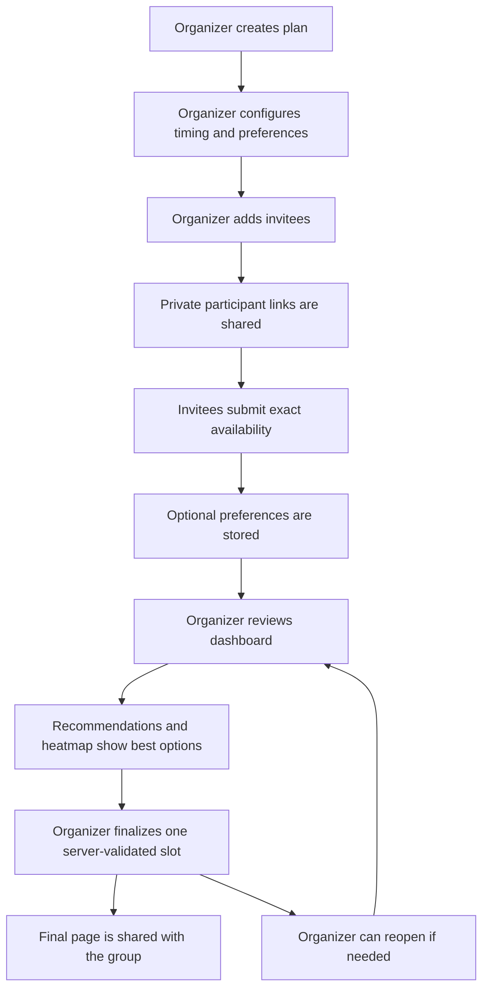
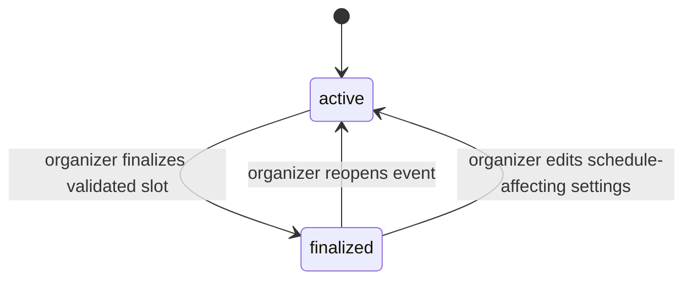
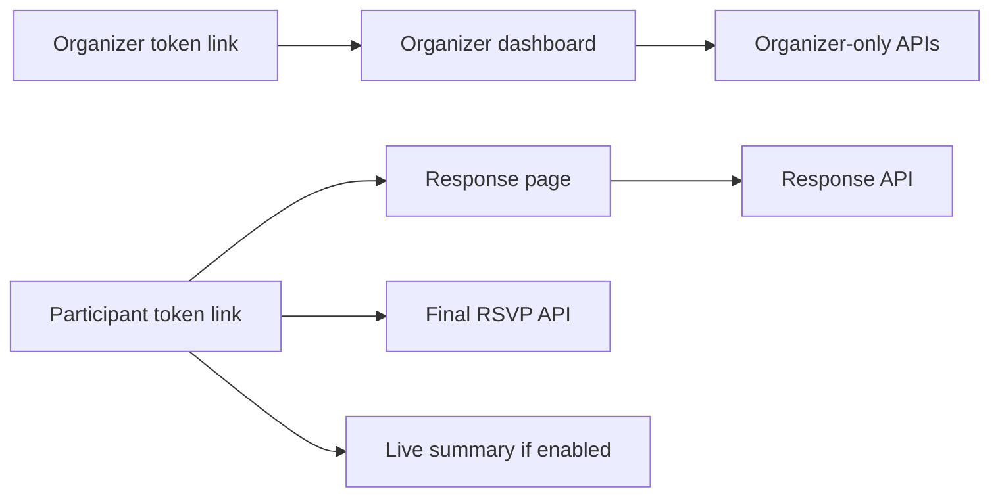

# Product Requirements Document

## Document Status

This PRD describes the current shipped product in this repository. It is not a speculative roadmap. It captures what Togoo does today, who it serves, how the main flows work, and which product constraints are intentional or still unresolved.

## Product Summary

Togoo is a lightweight group scheduling product for small plans. It replaces messy chat-thread coordination with a structured flow where one organizer defines the scheduling constraints, invites people with private links, collects availability and preferences, reviews ranked meeting-time recommendations, and finalizes one confirmed time.

The product is optimized for low-friction coordination. Invitees do not create accounts, install apps, or connect calendars.

## Problem Statement

Small-group planning often happens in chat threads. This creates repeated failure modes:

- Availability answers arrive in inconsistent formats.
- The organizer has to manually compare responses.
- Important attendees can be missed.
- People change availability after the organizer already counted them.
- Preference information gets mixed with scheduling messages.
- The final answer gets buried.

Togoo gives the organizer one source of truth and gives invitees a short, structured response form.

## Target Users

### Primary Persona: Organizer

The organizer creates the plan and makes the final decision.

Organizer needs:

- Create a plan quickly.
- Share invite links manually in the channel they already use.
- Know who has and has not responded.
- Mark some attendees as required or higher priority.
- Compare candidate times without spreadsheet work.
- Finalize one time and send a clean final page back to the group.

Typical organizer scenarios:

- Birthday dinner.
- Weekend meetup.
- Casual hangout.
- Study or work session.
- Small team social plan.

### Secondary Persona: Invitee

The invitee receives a private link and submits availability.

Invitee needs:

- Open the link without logging in.
- Understand the plan context.
- Pick exact times that work.
- Add useful preferences if requested.
- Edit the response later when the organizer allows it.
- Open the final confirmed invite and send a yes/no RSVP.
- Avoid accidentally submitting a suggested time without confirming availability.

## Product Goals

| Goal | Requirement |
| --- | --- |
| Reduce organizer work | Rank options automatically from submitted responses |
| Keep invitees moving | Avoid account creation and keep the response page focused |
| Support priority differences | Required attendees and priority tiers affect recommendation quality |
| Preserve final clarity | Publish one final page after confirmation |
| Handle realistic edits | Allow plan updates, response edits, and reopening finalized plans |
| Keep data portable | Let organizers export participant responses as CSV |

## Non-Goals

- Account-based collaboration.
- Enterprise calendar scheduling.
- Automatic email, SMS, or WhatsApp delivery.
- Calendar sync or ICS export.
- Venue discovery or restaurant recommendations.
- Payment collection.
- Full analytics dashboard.

## Product Principles

1. The organizer owns the final decision.
2. Invitees should need only a private link.
3. Availability should be exact enough to rank real meeting windows.
4. Recommendations should explain tradeoffs, not hide them.
5. Finalization must be server-validated so stale or manipulated client choices do not become final.

## End-to-End Flow

## Functional Requirements

### Event Creation

The product must let the organizer define:

| Field | Requirement |
| --- | --- |
| Title | Required, human-readable plan title |
| Description | Optional context for invitees |
| Event type | One of dinner, meetup, hangout, work session, or custom |
| Timezone | Required and used for display, slot generation, scoring, and CSV export |
| Date range start | Required Unix timestamp |
| Date range end | Required Unix timestamp after start |
| Meeting duration | 15 to 480 minutes |
| Slot granularity | 15, 30, 60, 120, or 360 minutes |
| Minimum attendance threshold | Optional filter for candidate recommendations |
| Scoring mode | One of the supported recommendation modes |
| Suggested time | Optional start and end inside the event range |
| Response deadline | Optional timestamp after which new responses are blocked |
| Enabled preferences | Controls which preference inputs invitees see |
| Required preferences | Forces at least one meaningful enabled preference |
| Participant edit setting | Controls whether submitted responses can be changed |
| Participant summary setting | Controls whether invitees can view live results |
| Required-by-default setting | Controls default required flag for new invitees |

The create flow must persist draft state in browser `localStorage` so refreshing `/events/new` does not erase progress.

### Participant Invitations

The organizer must be able to:

- Add a participant with name, optional email, optional phone, required flag, and priority tier.
- Generate a private `/r/[token]` response link for each participant.
- Copy or share links manually.
- Regenerate a participant token.
- Update participant details.
- Delete participants except the organizer.

Participant token regeneration must deactivate older participant tokens for that participant.

### Invitee Response

The invitee response page must:

- Validate the token before showing event details.
- Show event title, description, timezone, duration, and response constraints.
- Generate exact selectable meeting slots from the organizer's range, duration, and granularity.
- Highlight an organizer-suggested time when present.
- Avoid preselecting suggested times automatically.
- Preload existing availability and preferences for returning invitees.
- Submit at least one availability window.
- Store optional preferences if the organizer enabled them.
- Block submissions when the event is finalized.
- Block submissions after the response deadline.
- Block response updates when participant editing is disabled.
- Show clear validation feedback when required information is missing.

### Preferences

The product can collect:

| Preference | Current usage |
| --- | --- |
| Food preference | Stored, exported, not scored |
| Food note | Stored, exported, not scored |
| Budget | Stored, exported, not scored |
| Preferred area | Stored, exported, not scored |
| Weekday/weekend | Stored, exported, scored |
| Time of day | Stored, exported, scored |
| Indoor/outdoor | Stored, exported, not scored |
| Notes | Stored, exported, not scored |

### Organizer Dashboard

The organizer dashboard must provide:

- Event summary.
- Response counts.
- Participant list.
- Add, update, delete, and token-regenerate participant controls.
- Event edit controls.
- CSV export for participant responses.
- Recommendation cards.
- Availability overlap heatmap.
- Organizer overrides.
- Activity feed.
- Finalization action.
- Reopen action for finalized plans.
- Delete plan action.

### Recommendations

The recommendation engine must:

- Normalize submitted windows into fixed-width slots.
- Generate candidate meeting windows that cover the configured duration.
- Require all slots in a candidate window to be covered by the same attending participants.
- Drop candidates outside the event range.
- Drop candidates below the minimum attendance threshold.
- Apply organizer overrides.
- Score candidates according to the selected scoring mode.
- Return named recommendation buckets and the top candidate list.

Named recommendation buckets:

| Bucket | Definition |
| --- | --- |
| `best_overall` | Highest composite score |
| `best_attendance` | Highest attending count |
| `best_required_match` | Best required attendee coverage, then attendance |
| `best_time_fit` | Best time preference score, then attendance |
| `most_popular` | Same selected candidate as best attendance, labeled for presentation |
| `top_candidates` | Up to the top 10 composite-ranked candidates |

### Scoring Modes

| Mode | Product intent |
| --- | --- |
| `maximize_attendance` | Best default for casual groups where attendance count matters most |
| `prioritize_required` | Best when required attendees must be included |
| `vip_priority` | Best when priority-tier attendees should influence ranking more heavily |
| `time_optimized` | Best when time-of-day fit matters more than raw attendance |

### Organizer Overrides

The organizer can influence candidate recommendations with:

| Override | Behavior |
| --- | --- |
| `block_time` | Removes candidates that overlap a blocked time range |
| `force_exclude` | Removes a candidate with the matching slot start |
| `force_include` | Keeps a candidate with the matching slot start even if other filters would remove it |

### Finalization

The organizer must be able to:

- Select a recommendation.
- Finalize one slot with required location name, address, and Google Maps link.
- Store optional final notes and invite message through the API.
- Publish `/e/[eventId]/final`.
- Share private confirmed invite links where participants can RSVP yes or no.
- Track final RSVP status per participant.
- Reopen the event later.

Finalization must recompute valid candidates server-side and reject a selected slot if it is no longer valid.

Final RSVP status is stored as an integer code in D1: `0` pending, `1` yes, and `2` no. Product surfaces show readable labels (`pending`, `yes`, `no`) in the organizer dashboard, participant invite, API responses, and CSV export.

### Live Summary

When `show_results_to_participants` is enabled, invitees can view a token-gated summary page. The summary should expose useful group status without giving invitees organizer-only controls.

### CSV Export

The organizer must be able to download participant responses as CSV. The export includes participant identity fields, response status, final RSVP status, final RSVP update time, required flag, priority tier, last updated time in event timezone, selected slot count, selected slots, and stored preferences.

## State Model

State behavior:

| State | Behavior |
| --- | --- |
| `active` | Invitees can respond if token, deadline, and edit rules allow it |
| `finalized` | Availability response submission is blocked; final page and private yes/no RSVP actions are available |

## Access Requirements

Access model requirements:

- The product must not require accounts.
- Organizer APIs must require an active organizer token.
- Participant response must require an active participant token.
- Final yes/no RSVP submission must require an active participant token and a finalized event.
- Token lookup must reject inactive or expired tokens.
- Participant token regeneration must invalidate old participant links.
- Organizer token rotation is not currently required by the shipped product.

## UX Requirements

- The invitee flow must be usable on mobile.
- The organizer dashboard must prioritize scanability over dense tables.
- Primary actions must be obvious at each step.
- Validation failures must be understandable and close to the related action.
- Suggested times must look helpful without coercing a response.
- Reduced-motion users must not be forced through motion-heavy interactions.
- Date and datetime fields must be keyboard-friendly and accessible.
- Adding invitees should feel non-blocking while links are generated.
- The shared footer must show consistent `© 2026`, `v0.5.1`, `FAQ`, and `GitHub` links across app screens.

## Data Retention and Persistence Requirements

| Data | Persistence |
| --- | --- |
| Events and responses | Cloudflare D1 |
| Invite tokens | Cloudflare D1 |
| Recommendation snapshot | Latest snapshot per event in Cloudflare D1 |
| Activity log | Cloudflare D1 |
| Recent events | Browser-local `localStorage` |
| In-progress create draft | Browser-local `localStorage` |

## Success Criteria

The product is successful when:

- Organizers can create a plan and generate invite links quickly.
- Invitees can respond without instructions beyond the private link.
- Organizers can see which people have responded.
- Recommendations reduce manual comparison work.
- Finalization creates one clear answer for the group.
- The local smoke test can complete create, invite, respond, recommend, and finalize.

## Current Constraints

- No account system.
- No notification delivery.
- No ICS export.
- No external calendar sync.
- No venue recommendation workflow.
- No payment workflow.
- No organizer token rotation UI.
- No append-only recommendation history.
- Food, budget, preferred area, and indoor/outdoor preferences are stored but not scored.

## Known Product Gaps

| Gap | Impact |
| --- | --- |
| No notification delivery | Organizer must manually share links and final page |
| No calendar export | Participants must manually add the final time to calendars |
| No venue workflow | Togoo decides when, not where |
| No accounts | Simpler invitee flow, but no cross-device organizer identity |
| No analytics | Product success is verified by tests and manual usage rather than built-in metrics |
| No organizer token rotation | Lost organizer links require database-level recovery or plan recreation |

## Future Considerations

These are not current requirements, but they are natural product extensions:

- ICS export for final pages.
- Organizer token rotation or recovery.
- Optional notification delivery.
- Venue shortlist after time finalization.
- Scoring for food, budget, area, and indoor/outdoor preferences.
- Multi-organizer plans.
- Historical recommendation snapshots for audit or trend analysis.
