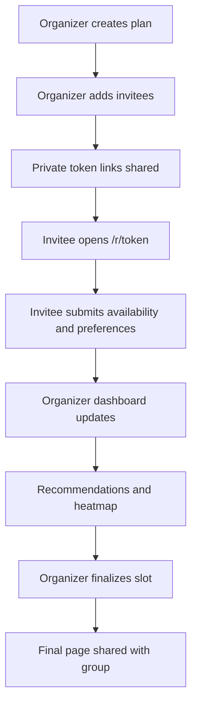
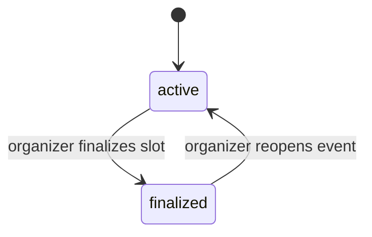

# PRD

## Document status

This PRD describes the current shipped product in this repository.

It is not a roadmap pitch. It is a product requirements document for what the app does now, the users it serves, and the constraints already present in the code.

## Product summary

Togoo is a group scheduling product for small plans.

The organizer defines the time window and constraints once, sends private invite links, collects replies, reviews ranked options, and confirms one final slot.

The product is designed for low-friction coordination without requiring accounts from invitees.

## Problem

Small-group planning usually happens in chat threads.

That creates a few recurring problems:

- availability is scattered across messages
- people reply in different formats
- organizers have to manually compare replies
- important attendees are easy to miss
- the final answer gets buried in the thread

Togoo replaces that with one structured flow.

## Users

### Primary user: organizer

The organizer:

- creates the plan
- chooses timing and scoring rules
- invites people
- monitors replies
- makes the final decision

Typical use cases:

- birthday dinner
- meetup
- hangout
- work session

### Secondary user: invitee

The invitee:

- opens a private token link
- shares availability
- optionally shares preferences
- may return later to edit the reply if allowed

## Product goals

- reduce scheduling work for the organizer
- keep the invitee flow short and obvious
- rank meeting options instead of forcing the organizer to manually compare replies
- support plans where some attendees matter more than others
- give the group one final page once the plan is confirmed

## Non-goals

- team calendars and enterprise scheduling workflows
- account-based collaboration
- venue discovery
- messaging delivery infrastructure
- calendar sync or export

## Core product flows

### Organizer flow

1. Create a plan
2. Configure timing rules and reply settings
3. Add invitees and generate private links
4. Watch replies come in on the organizer dashboard
5. Review ranked options and the overlap heatmap
6. Finalize one slot
7. Share the final page back to the group

### Invitee flow

1. Open private link
2. Review plan details
3. Select exact meeting slots
4. Optionally add preferences
5. Submit reply
6. Optionally edit later if allowed
7. Optionally view the live summary if enabled

## User flow diagram

## Functional requirements

### Event creation

The product must let the organizer define:

- title
- optional description
- event type
- timezone
- date range
- allowed daily hours
- meeting duration
- slot granularity
- scoring mode
- optional suggested time
- optional response deadline
- enabled preference questions
- participant edit setting
- participant live summary visibility
- required-preference setting
- default required-attendee behavior for new invitees

The product must preserve in-progress create-flow state through a browser refresh on the create page.

### Invitee replies

The product must:

- allow replies without account creation
- validate token access before showing the reply page
- support multiple exact meeting slots derived from organizer timing rules
- support preference collection
- preload prior replies when present
- block reply changes if the event is finalized
- block reply changes if the deadline has passed
- block edits when participant edits are disabled
- show any organizer-suggested slot as a highlighted suggestion without preselecting it for the participant

### Participant management

The organizer must be able to:

- add participants
- update participant details
- remove participants
- mark participants as required
- assign priority tier
- regenerate invite tokens

### Recommendations

The product must:

- normalize raw availability into slots
- compute ranked candidate windows
- expose at least:
  - best overall
  - best attendance
  - best required-attendee match
  - best time fit
  - most popular
- show the organizer a heatmap of overlap

### Finalization

The organizer must be able to:

- select a recommendation
- finalize one slot
- reopen the event later if needed
- delete the plan entirely
- access a final public-facing summary page

## Product settings

### Scoring modes

The product supports these scoring modes:

- `maximize_attendance`
- `prioritize_required`
- `vip_priority`
- `time_optimized`

### Preference inputs

The product can ask invitees about:

- food preference
- budget
- preferred area
- weekday or weekend
- time of day
- indoor or outdoor
- freeform notes

## Plan states

The event state machine is small.

## Product constraints in current code

- scoring only uses attendance, required-attendee coverage, time-of-day preference, and weekday/weekend preference
- stored food, budget, area, travel distance, and indoor/outdoor preferences are not scored yet
- organizer overrides exist in the backend but are not exposed in the dashboard UI
- the app uses token links instead of user accounts
- recent plans are stored in the local browser only

## UX requirements

- invitee flow must stay usable on mobile
- organizer dashboard must prioritize scanability over dense tables
- primary actions must stay obvious at each step
- validation failures must give immediate feedback
- reduced-motion users must not be forced through motion-heavy interactions
- create-flow progress should survive refresh without making the user restart from step one
- adding invitees should feel non-blocking, with clear pending feedback while links are generated in the background

## Success criteria

The product is doing its job if:

- organizers can go from empty plan to invite links quickly
- invitees can reply without needing explanation
- organizers can choose a final slot from ranked options instead of reading chat logs
- finalized plans are easy to share back to the group

## Known gaps

- no notification delivery
- no ICS export
- no account system
- no venue workflow
- no analytics for organizer outcomes
- no override management UI
