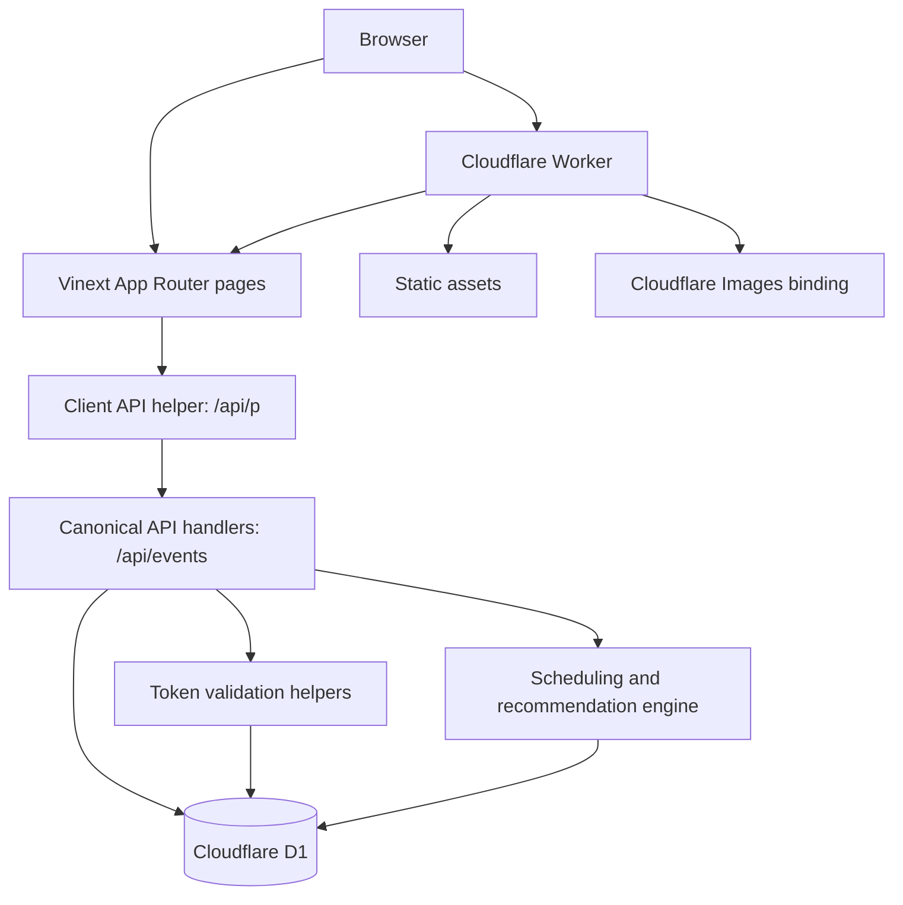
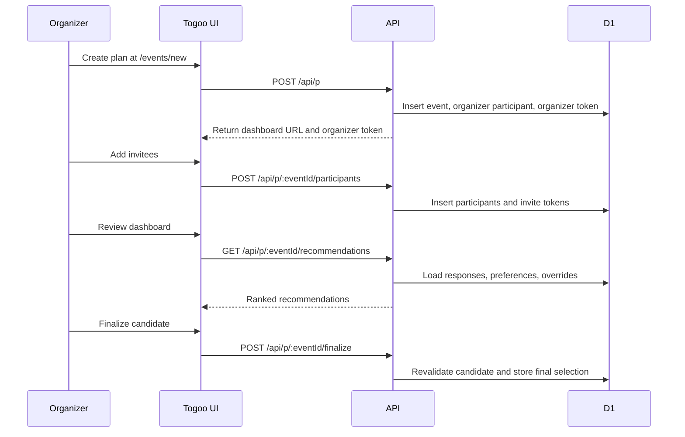
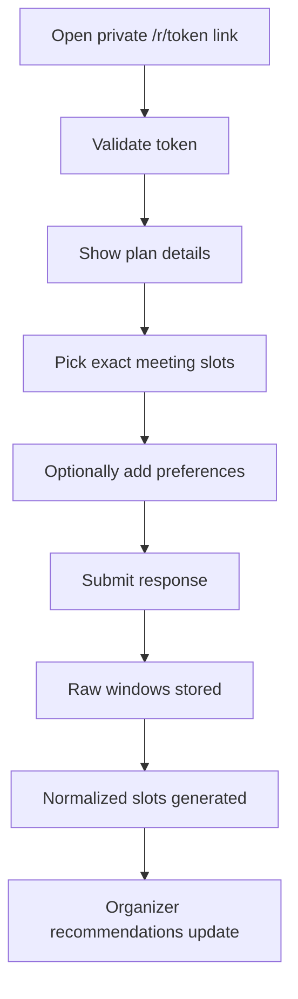
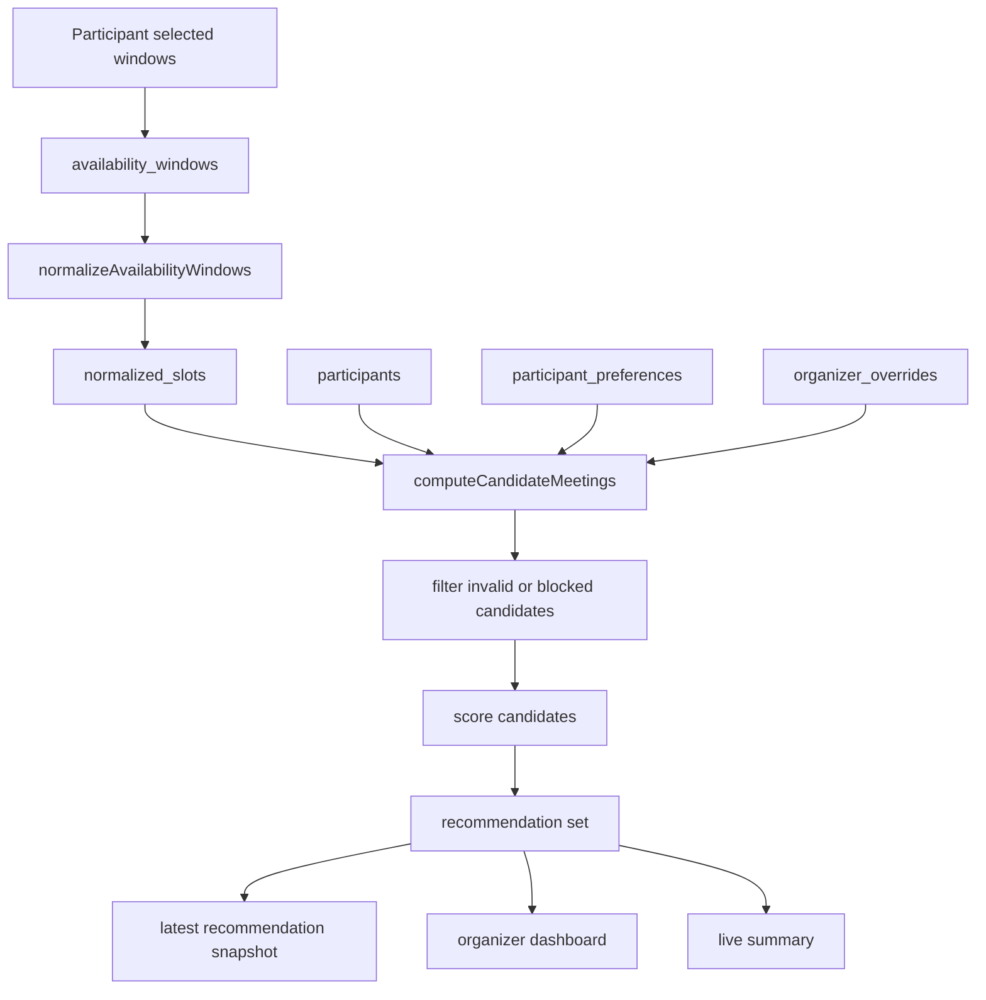
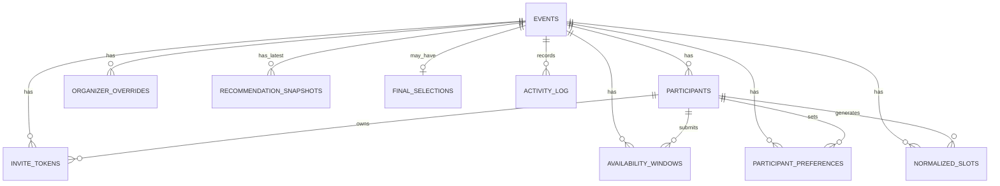

# Togoo

Togoo is a token-based group scheduling app for small plans.

An organizer creates a plan, shares private invite links, collects exact slot availability and lightweight preferences, reviews ranked recommendations, and publishes one final confirmed time. Invitees do not need accounts.

## Current Version

| Surface | Version |
| --- | --- |
| UI footer | `0.5.1` |
| npm package | `0.1.0` |

## Product Snapshot

Togoo is built around one practical scheduling loop:

1. Create a plan with a time range, duration, timezone, scoring mode, and response settings.
2. Add invitees and generate one private response link per participant.
3. Let invitees select exact meeting slots and optional preferences.
4. Rank possible meeting windows from submitted availability.
5. Let the organizer finalize a validated recommended slot.
6. Share a final page with the group.

Togoo is intentionally not an account system, calendar product, notification service, or venue recommendation engine.

## Core Capabilities

| Area | What exists today |
| --- | --- |
| Event creation | title, description, event type, timezone, continuous date range, duration, slot granularity, minimum attendance threshold, scoring mode, suggested time, response deadline |
| Invite links | private organizer link and private participant links backed by random tokens |
| Participant response | exact slot selection, existing response preload, optional preference form, response updates when allowed |
| Preferences | food, budget, preferred area, weekday/weekend, time of day, indoor/outdoor, notes |
| Organizer dashboard | event editing, participant management, response stats, activity, recommendations, heatmap, overrides, CSV export, finalization, reopen, delete |
| Recommendations | ranked candidate windows based on attendance, required attendees, priority tier, time preference, and day preference |
| Final page | public finalized event view after the organizer confirms a slot |
| Local persistence | recent events and in-progress create flow stored in browser `localStorage` |

## Architecture



## Main Flows

### Organizer Flow



### Invitee Flow



## Application Routes

| Route | File | Purpose |
| --- | --- | --- |
| `/` | `app/page.tsx` | Landing page and local recent-plan shortcuts |
| `/faq` | `app/faq/page.tsx` | Product FAQ |
| `/events/new` | `app/events/new/page.tsx` | Multi-step organizer create flow |
| `/r/[token]` | `app/r/[token]/page.tsx` | Participant response flow |
| `/e/[eventId]/organizer/[token]` | `app/e/[eventId]/organizer/[token]/page.tsx` | Organizer dashboard |
| `/e/[eventId]/summary/[token]` | `app/e/[eventId]/summary/[token]/page.tsx` | Token-gated live summary when enabled |
| `/e/[eventId]/final` | `app/e/[eventId]/final/page.tsx` | Final confirmed event page |
| `/e/[eventId]/respond/[token]` | `app/e/[eventId]/respond/[token]/page.tsx` | Legacy redirect to `/r/[token]` |

## API Surface

The canonical API namespace is `/api/events`. The browser UI uses `/api/p` aliases through `lib/client-api.ts`; these aliases forward to the same handlers.

| Method | Canonical route | Browser alias | Purpose |
| --- | --- | --- | --- |
| `POST` | `/api/events` | `/api/p` | Create event, organizer participant, organizer token |
| `GET` | `/api/events/[eventId]` | `/api/p/[eventId]` | Organizer-only event fetch |
| `PUT` | `/api/events/[eventId]` | `/api/p/[eventId]` | Organizer-only event update |
| `DELETE` | `/api/events/[eventId]` | `/api/p/[eventId]` | Organizer-only event delete |
| `GET` | `/api/events/[eventId]/participants` | `/api/p/[eventId]/participants` | List participants with active participant tokens |
| `POST` | `/api/events/[eventId]/participants` | `/api/p/[eventId]/participants` | Add participant and generate invite link |
| `PUT` | `/api/events/[eventId]/participants/[participantId]` | `/api/p/[eventId]/participants/[participantId]` | Update participant details |
| `DELETE` | `/api/events/[eventId]/participants/[participantId]` | `/api/p/[eventId]/participants/[participantId]` | Delete participant, except organizer |
| `POST` | `/api/events/[eventId]/participants/[participantId]/token` | `/api/p/[eventId]/participants/[participantId]/token` | Regenerate participant invite token |
| `GET` | `/api/events/[eventId]/participants/export` | `/api/p/[eventId]/participants/export` | Export participant responses as CSV |
| `POST` | `/api/events/[eventId]/respond` | `/api/p/[eventId]/respond` | Submit or update participant response |
| `GET` | `/api/events/[eventId]/recommendations` | `/api/p/[eventId]/recommendations` | Compute recommendations and store latest snapshot |
| `POST` | `/api/events/[eventId]/finalize` | `/api/p/[eventId]/finalize` | Revalidate and finalize selected slot |
| `POST` | `/api/events/[eventId]/reopen` | `/api/p/[eventId]/reopen` | Reopen finalized event |
| `GET` | `/api/events/[eventId]/overrides` | `/api/p/[eventId]/overrides` | List organizer overrides |
| `POST` | `/api/events/[eventId]/overrides` | `/api/p/[eventId]/overrides` | Add organizer override |
| `DELETE` | `/api/events/[eventId]/overrides` | `/api/p/[eventId]/overrides` | Delete organizer override |
| `GET` | `/api/validate-token` | none | Validate organizer or participant token |

Organizer-only endpoints require the `x-organizer-token` header. Participant response submission sends the participant token in the request body.

## Recommendation Model



Recommendations currently score:

| Signal | Used today |
| --- | --- |
| Attendance overlap | yes |
| Required attendee coverage | yes |
| Priority tier weighting | yes |
| Preferred time of day | yes |
| Preferred weekday/weekend | yes |
| Food preference | stored only |
| Budget preference | stored only |
| Preferred area | stored only |
| Indoor/outdoor preference | stored only |

Scoring modes:

| Mode | Behavior |
| --- | --- |
| `maximize_attendance` | Optimizes for attendance first |
| `prioritize_required` | Weights required attendee coverage most heavily |
| `vip_priority` | Weights participant priority tiers most heavily |
| `time_optimized` | Weights time-of-day preference most heavily |

## Data Model



| Table | Purpose |
| --- | --- |
| `events` | Plan settings, timing range, scoring mode, status, deadline |
| `participants` | Organizer and invitees, response state, required flag, priority tier |
| `invite_tokens` | Private organizer and participant access tokens |
| `availability_windows` | Raw submitted exact meeting windows |
| `participant_preferences` | Optional preference data per participant |
| `organizer_overrides` | Manual `block_time`, `force_include`, and `force_exclude` rules |
| `normalized_slots` | Slotized availability used by scoring |
| `recommendation_snapshots` | Latest stored recommendation response per event |
| `final_selections` | Confirmed final slot and optional notes |
| `activity_log` | Event audit trail |

## Stack

| Layer | Technology |
| --- | --- |
| App runtime | Vinext |
| UI | React 19, Next-style App Router, Tailwind CSS |
| Forms and date fields | `react-aria-components`, `@internationalized/date`, `@vvo/tzdb` |
| API/runtime | Cloudflare Workers |
| Database | Cloudflare D1 |
| ORM | Drizzle ORM |
| Validation | Zod |
| Testing | Vitest plus local HTTP smoke script |

## Project Structure

```text
app/
  page.tsx                                      Landing page
  faq/page.tsx                                  FAQ
  events/new/page.tsx                           Multi-step create flow
  r/[token]/page.tsx                            Participant response flow
  e/[eventId]/organizer/[token]/page.tsx        Organizer dashboard
  e/[eventId]/summary/[token]/page.tsx          Token-gated live summary
  e/[eventId]/final/page.tsx                    Final confirmed page
  e/[eventId]/respond/[token]/page.tsx          Legacy redirect
  api/                                          Canonical and alias route handlers

components/
  availability-picker.tsx                       Slot picker
  preference-form.tsx                           Preference form
  recommendation-cards.tsx                      Ranked recommendation UI
  overlap-heatmap.tsx                           Availability heatmap
  my-events.tsx                                 Browser-local recent plans
  share-buttons.tsx                             WhatsApp and email share actions
  app-footer.tsx                                Shared app footer
  ui/                                           Shared primitives

lib/
  db/schema.ts                                  Drizzle schema
  db/index.ts                                   D1 and Drizzle setup
  scheduling.ts                                 Normalization, scoring, finalization validation
  normalized-slots.ts                           Batched normalized slot inserts
  validation.ts                                 Zod request schemas
  auth.ts                                       Token lookup helpers
  tokens.ts                                     Random id and token generation
  event-settings.ts                             Preference settings helpers
  client-api.ts                                 Browser-facing /api/p paths
  utils.ts                                      Date, timezone, formatting helpers

drizzle/migrations/
  0001_init.sql                                 Base schema migration

tests/
  scheduling.test.ts                            Recommendation regression tests
  finalize.test.ts                              Finalization validation tests
  normalized-slots.test.ts                      Slot insertion tests
  utils-timezone.test.ts                        Timezone utility tests

scripts/
  smoke-local.mjs                               Local HTTP scheduling-loop smoke test
```

## Local Development

### Prerequisites

| Requirement | Notes |
| --- | --- |
| Node.js | Node 22+ recommended |
| npm | Used by this repo |
| Wrangler | Required for D1 migrations and deployment |
| Cloudflare account | Required for remote deploys and remote D1 |

### Setup

```bash
npm install
npm run db:migrate:local
npm run dev
```

Open `http://localhost:3000`.

### Local Smoke Test

Keep the dev server running, then run:

```bash
npm run smoke:local
```

The smoke script verifies app reachability, event creation, participant invite generation, response submission, recommendations, and finalization through the HTTP API.

### Optional Demo Data

```bash
npm run seed:local
```

## Database

The repository currently has one source-controlled migration:

```text
drizzle/migrations/0001_init.sql
```

Apply migrations with:

```bash
npm run db:migrate:local
npm run db:migrate:remote
```

Schema changes should be made through new migration files in `drizzle/migrations/`. Do not edit an already-applied migration.

## Environment

`wrangler.toml` defines the app worker and D1 binding:

```toml
name = "togoo"
main = "./worker/index.ts"

[[d1_databases]]
binding = "DB"
database_name = "togoo-db"
migrations_dir = "drizzle/migrations"
```

For Drizzle tooling and remote migration commands, keep local credentials in `.env`:

```env
CLOUDFLARE_ACCOUNT_ID=your_account_id
CLOUDFLARE_DATABASE_ID=your_database_id
CLOUDFLARE_D1_TOKEN=your_api_token
```

Do not commit `.env`.

## Scripts

| Command | Purpose |
| --- | --- |
| `npm run dev` | Start Vinext dev server |
| `npm run build` | Production build |
| `npm run deploy` | Deploy with Vinext |
| `npm run deploy:prod` | Run checks, apply remote migrations, deploy |
| `npm run typecheck` | TypeScript check |
| `npm test` | Vitest regression tests |
| `npm run check` | Typecheck, tests, production build |
| `npm run smoke:local` | Local HTTP smoke test |
| `npm run db:generate` | Generate Drizzle migration artifacts |
| `npm run db:migrate:local` | Apply D1 migrations locally |
| `npm run db:migrate:remote` | Apply D1 migrations remotely |
| `npm run db:studio` | Open Drizzle Studio |
| `npm run seed:local` | Seed local D1 data |
| `npm run seed:remote` | Seed remote D1 data |

## Verification

Use this before shipping scheduling, API, or schema changes:

```bash
npm run check
```

For end-to-end local confidence:

```bash
npm run db:migrate:local
npm run dev
npm run smoke:local
```

Known build warning: Vinext can report a chunk-size warning for worker/client output over 500 kB. That warning is currently non-blocking.

## Security Model

| Area | Current behavior |
| --- | --- |
| Accounts | None |
| Sessions | None |
| Organizer access | Random organizer token, sent as `x-organizer-token` |
| Participant access | Random participant token in private `/r/[token]` link |
| Token generation | `crypto.getRandomValues` over an alphanumeric alphabet |
| Token length | 32 characters by default |
| Token expiry | Schema supports `expires_at`; current created tokens normally do not expire |
| Participant token rotation | Regeneration deactivates old participant tokens |
| Organizer token rotation | Not implemented today |
| Finalization safety | Server recomputes valid candidates and rejects invalid selected slots |

## Current Constraints

- No account system.
- No email or SMS delivery.
- No calendar sync or ICS export.
- No venue recommendation flow.
- No multi-organizer collaboration.
- Recommendation snapshots store the latest computed snapshot per event, not an append-only history.
- Food, budget, preferred area, and indoor/outdoor preferences are stored but not scored yet.
- Organizer tokens are not rotated through the UI.

## Related Docs

- `PRD.md` for product requirements, personas, flows, and scope.
- `TRD.md` for technical architecture, API contracts, schema, runtime, and implementation details.
- `DEPLOY.md` for deployment steps.
- `DESIGN.md` for design-system notes.
