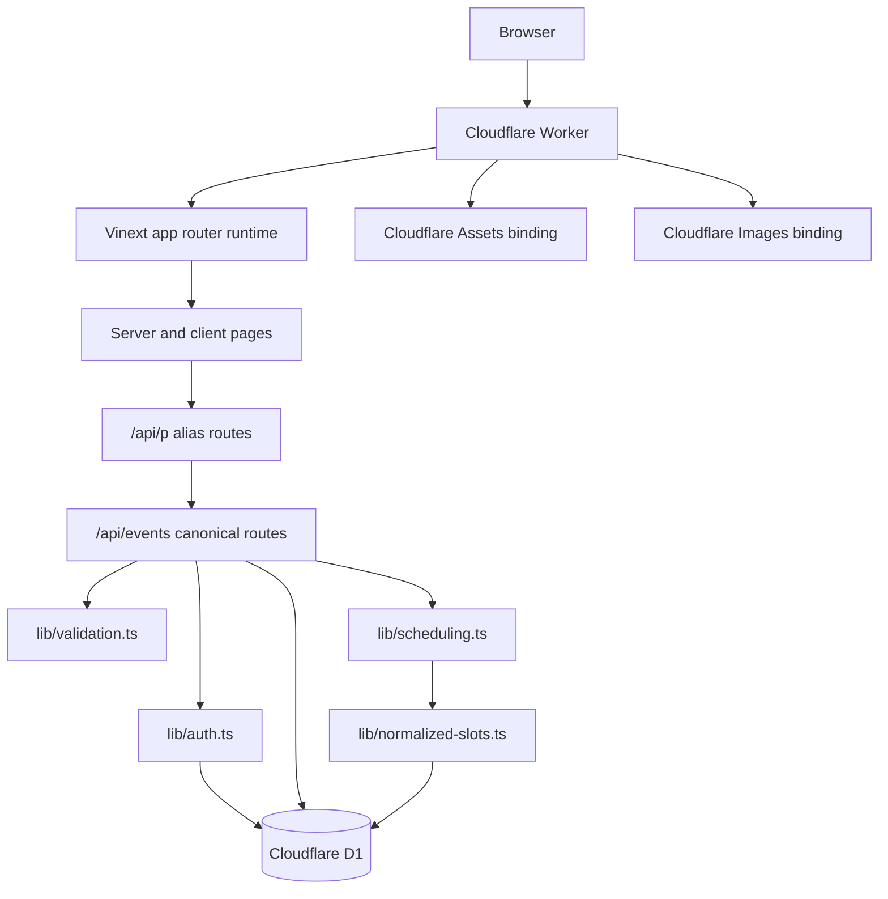
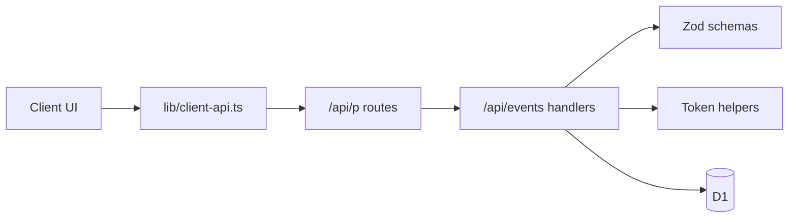
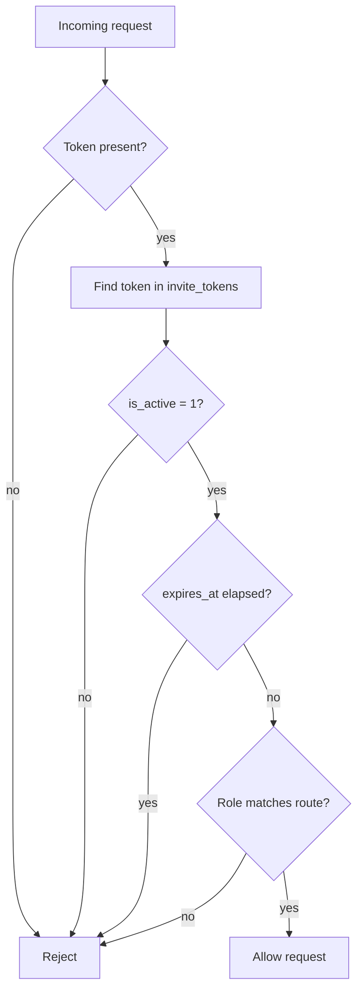
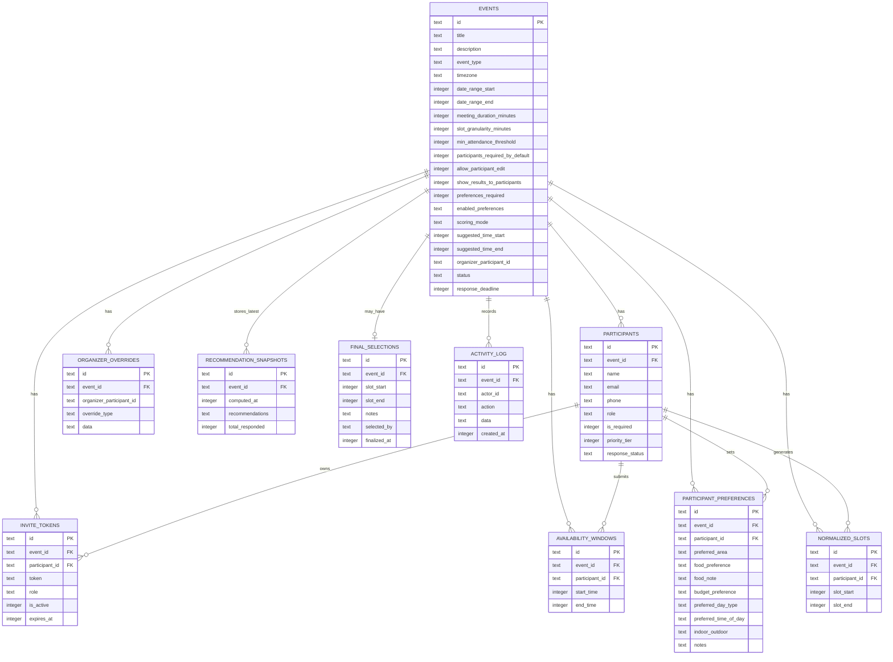
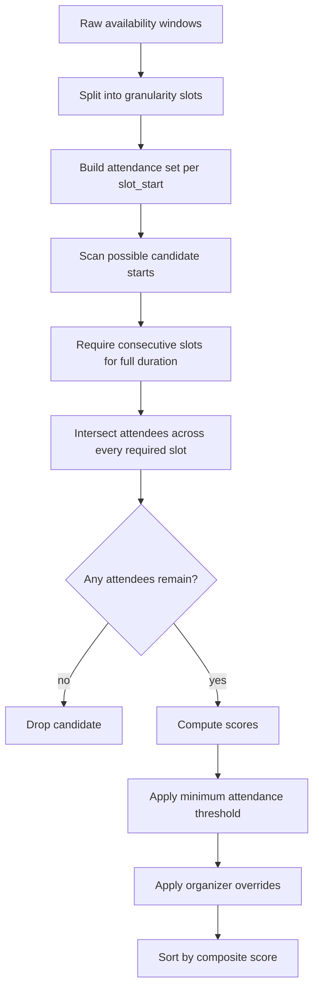
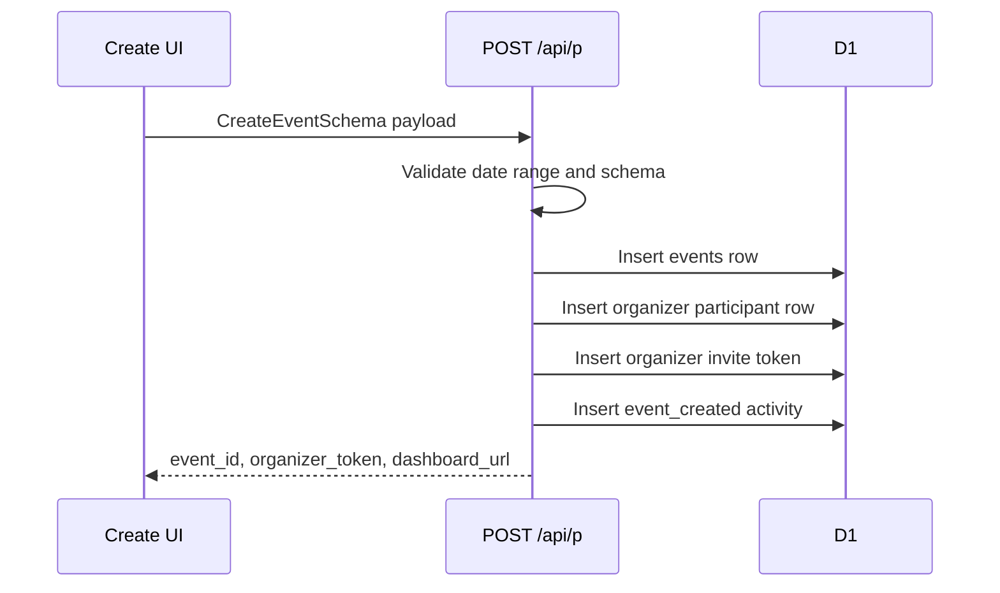
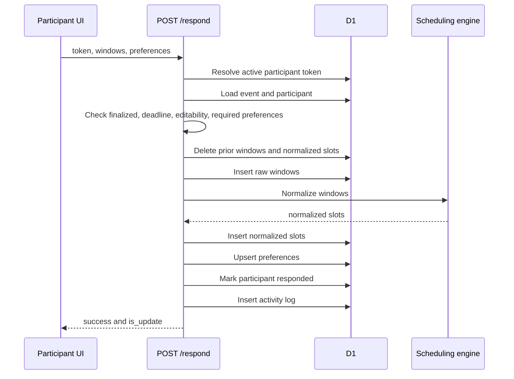
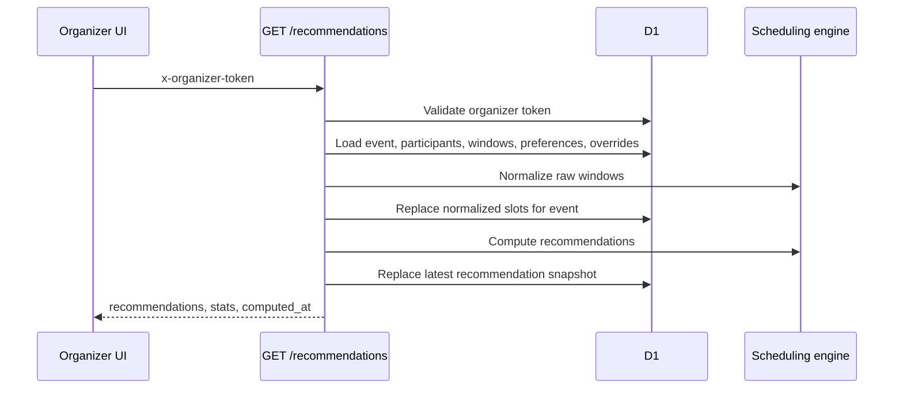
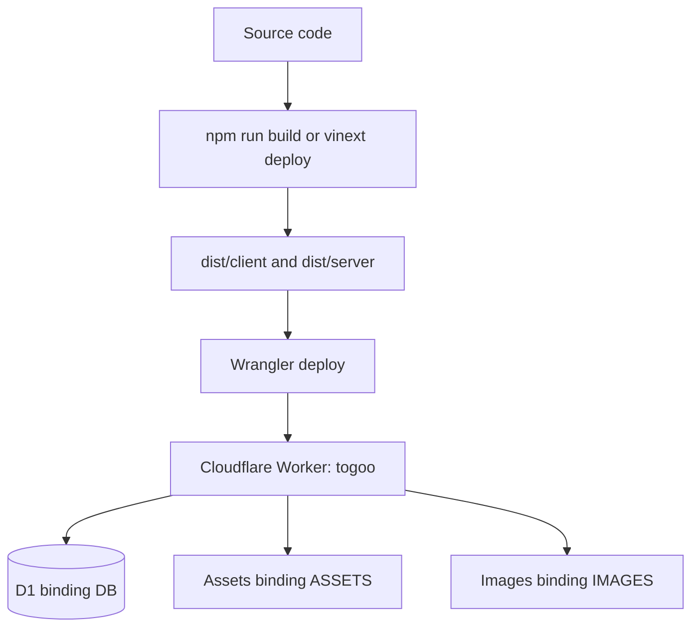

# Technical Requirements Document

## Document Status

This TRD describes the current implementation in this repository. It covers runtime architecture, routes, API behavior, authentication, data model, scheduling logic, deployment, testing, and known implementation limits.

## System Summary

Togoo is a token-gated group scheduling application built with Vinext, React 19, Cloudflare Workers, Cloudflare D1, Drizzle ORM, Tailwind CSS, and Zod.

The system has no account layer. Access is controlled through active invite tokens stored in D1:

- Organizer tokens unlock organizer dashboard and organizer-only APIs.
- Participant tokens unlock response submission and participant-visible flows.

## Runtime Architecture



## Source Layout

| Path | Purpose |
| --- | --- |
| `app/` | App Router pages and API handlers |
| `components/` | Shared UI and product components |
| `lib/db/schema.ts` | Drizzle table definitions and relations |
| `lib/db/index.ts` | D1 to Drizzle adapter setup |
| `lib/scheduling.ts` | Availability normalization, candidate generation, scoring, finalization validation |
| `lib/normalized-slots.ts` | Batched normalized slot insertion |
| `lib/validation.ts` | Zod request schemas |
| `lib/auth.ts` | Active token lookup helpers |
| `lib/tokens.ts` | Random ids and access tokens |
| `lib/event-settings.ts` | Preference settings helpers |
| `lib/client-api.ts` | Browser-facing `/api/p` URL builder |
| `lib/utils.ts` | Timezone, formatting, and timestamp utilities |
| `worker/index.ts` | Cloudflare Worker entrypoint and image optimization routing |
| `vite.config.ts` | Vinext, Cloudflare build plugin, and local D1 shim |
| `wrangler.toml` | Worker, asset, image, and D1 bindings |
| `drizzle/migrations/0001_init.sql` | Current schema migration |
| `tests/` | Vitest regression tests |
| `scripts/smoke-local.mjs` | Local end-to-end HTTP smoke test |

## Page Routes

| Route | File | Rendering role |
| --- | --- | --- |
| `/` | `app/page.tsx` | Landing page, CTA, local recent plans |
| `/faq` | `app/faq/page.tsx` | FAQ content |
| `/events/new` | `app/events/new/page.tsx` | Client-heavy multi-step create flow |
| `/r/[token]` | `app/r/[token]/page.tsx` | Participant response page |
| `/e/[eventId]/organizer/[token]` | `app/e/[eventId]/organizer/[token]/page.tsx` | Organizer dashboard |
| `/e/[eventId]/summary/[token]` | `app/e/[eventId]/summary/[token]/page.tsx` | Token-gated participant summary |
| `/e/[eventId]/final` | `app/e/[eventId]/final/page.tsx` | Final confirmed page |
| `/e/[eventId]/respond/[token]` | `app/e/[eventId]/respond/[token]/page.tsx` | Legacy redirect to `/r/[token]` |

## API Architecture

The canonical API surface lives under `/api/events`. Browser code calls `/api/p` aliases through `lib/client-api.ts` because some browser extensions can interfere with paths containing `/api/events`. Alias route files re-export the canonical handlers.



## API Route Inventory

| Method | Canonical route | Alias route | Auth | Behavior |
| --- | --- | --- | --- | --- |
| `POST` | `/api/events` | `/api/p` | none | Create event, organizer participant, organizer token, activity log |
| `GET` | `/api/events/[eventId]` | `/api/p/[eventId]` | organizer token | Return event, response stats, activity, final selection |
| `PUT` | `/api/events/[eventId]` | `/api/p/[eventId]` | organizer token | Update event, recompute normalized slots, reopen if finalized schedule changed |
| `DELETE` | `/api/events/[eventId]` | `/api/p/[eventId]` | organizer token | Delete event and cascade related rows |
| `GET` | `/api/events/[eventId]/participants` | `/api/p/[eventId]/participants` | organizer token | Return participants with active participant invite tokens |
| `POST` | `/api/events/[eventId]/participants` | `/api/p/[eventId]/participants` | organizer token | Add participant and create invite token |
| `PUT` | `/api/events/[eventId]/participants/[participantId]` | `/api/p/[eventId]/participants/[participantId]` | organizer token | Update participant fields |
| `DELETE` | `/api/events/[eventId]/participants/[participantId]` | `/api/p/[eventId]/participants/[participantId]` | organizer token | Delete non-organizer participant |
| `POST` | `/api/events/[eventId]/participants/[participantId]/token` | `/api/p/[eventId]/participants/[participantId]/token` | organizer token | Deactivate old participant tokens and create a new one |
| `GET` | `/api/events/[eventId]/participants/export` | `/api/p/[eventId]/participants/export` | organizer token | Return CSV export |
| `POST` | `/api/events/[eventId]/respond` | `/api/p/[eventId]/respond` | participant token | Submit or update availability and preferences |
| `GET` | `/api/events/[eventId]/recommendations` | `/api/p/[eventId]/recommendations` | organizer token | Recompute recommendations and store latest snapshot |
| `POST` | `/api/events/[eventId]/finalize` | `/api/p/[eventId]/finalize` | organizer token | Recompute candidates, validate selected slot, upsert final selection |
| `POST` | `/api/events/[eventId]/reopen` | `/api/p/[eventId]/reopen` | organizer token | Set event active and delete final selection |
| `GET` | `/api/events/[eventId]/overrides` | `/api/p/[eventId]/overrides` | organizer token | List overrides newest first |
| `POST` | `/api/events/[eventId]/overrides` | `/api/p/[eventId]/overrides` | organizer token | Add override |
| `DELETE` | `/api/events/[eventId]/overrides` | `/api/p/[eventId]/overrides` | organizer token | Delete override by id |
| `GET` | `/api/validate-token` | none | active token | Return token role, event, participant, existing windows, existing preferences |

## API Contracts

### Create Event

`POST /api/p`

Required body fields include title, timezone, date range, organizer name, and scheduling settings. Zod defaults fill optional settings such as event type, duration, granularity, preferences, participant edit behavior, and scoring mode.

Response:

```json
{
  "event_id": "abc123",
  "organizer_token": "token",
  "organizer_participant_id": "org123",
  "dashboard_url": "/e/abc123/organizer/token"
}
```

### Add Participant

`POST /api/p/[eventId]/participants`

Headers:

```text
x-organizer-token: organizer-token
```

Body:

```json
{
  "name": "Asha",
  "email": "asha@example.com",
  "phone": "",
  "is_required": true,
  "priority_tier": 1
}
```

Response includes participant data, `invite_token`, and `/r/[token]` invite URL.

### Submit Response

`POST /api/p/[eventId]/respond`

Body:

```json
{
  "token": "participant-token",
  "availability_windows": [
    { "start_time": 1764504000, "end_time": 1764511200 }
  ],
  "preferences": {
    "preferred_area": "Indiranagar",
    "food_preference": "veg",
    "budget_preference": "medium",
    "preferred_day_type": "weekend",
    "preferred_time_of_day": "evening",
    "indoor_outdoor": "indoor",
    "notes": "Flexible by 30 minutes"
  }
}
```

Server behavior:

1. Validate token and body.
2. Reject finalized events.
3. Reject responses after deadline.
4. Reject updates if participant edits are disabled.
5. Enforce required preferences when configured.
6. Delete prior raw and normalized availability for the participant.
7. Insert new raw windows.
8. Insert normalized slots.
9. Upsert preferences.
10. Mark participant as responded.
11. Write activity log entry.

### Recommendations

`GET /api/p/[eventId]/recommendations`

Headers:

```text
x-organizer-token: organizer-token
```

Server behavior:

1. Validate organizer token.
2. Load event, participants, raw availability, preferences, and overrides.
3. Recompute normalized slots from raw windows.
4. Replace normalized slots for the event.
5. Compute recommendations.
6. Delete existing recommendation snapshots for the event.
7. Insert the latest snapshot.
8. Return recommendations and response stats.

### Finalize

`POST /api/p/[eventId]/finalize`

Headers:

```text
x-organizer-token: organizer-token
```

Body:

```json
{
  "slot_start": 1764504000,
  "slot_end": 1764511200,
  "notes": "Dinner at 7 PM"
}
```

The server recomputes candidate meetings and accepts the final slot only if the selected start and end match a valid current candidate.

## Authentication and Authorization

Source files:

- `lib/auth.ts`
- `lib/tokens.ts`



Token implementation details:

| Detail | Current implementation |
| --- | --- |
| Random source | `crypto.getRandomValues` |
| Alphabet | `0-9`, `A-Z`, `a-z` |
| Default token size | 32 characters |
| Default id size | 10 characters |
| Active check | `invite_tokens.is_active = 1` |
| Expiry check | `expires_at` is checked when present |
| Organizer API auth | `x-organizer-token` header |
| Participant response auth | `token` in request body |
| Token validation endpoint | `GET /api/validate-token?token=...` |

## Data Model

Schema source: `lib/db/schema.ts`



## Table Behavior

| Table | Key constraints and behavior |
| --- | --- |
| `events` | One row per plan; indexed by status; stores status as `active` or `finalized` |
| `participants` | Cascades with event; organizer is also a participant row; response status starts `pending` for invitees |
| `invite_tokens` | Unique token index; cascades with event and participant; active flag gates access |
| `availability_windows` | Raw participant-selected meeting windows |
| `participant_preferences` | Unique event-participant pair |
| `organizer_overrides` | JSON `data` field interpreted by scheduling engine |
| `normalized_slots` | Derived slots rebuilt on response submission, recommendation fetch, and schedule update |
| `recommendation_snapshots` | API keeps only the latest snapshot per event by deleting prior rows before insert |
| `final_selections` | Unique event id; finalization uses insert or update conflict handling |
| `activity_log` | Append-only event audit stream |

## Scheduling Engine

Source: `lib/scheduling.ts`

### Normalization

`normalizeAvailabilityWindows` converts raw selected windows into fixed-width slots using `slot_granularity_minutes`. Submitted start times are preserved so older `:30` responses continue to rank correctly. Slots are kept only when fully inside the event range.

### Candidate Generation



Candidate requirements:

- Candidate start must be a normalized slot start.
- Candidate end is `start + meeting_duration_minutes`.
- Every granularity slot needed for the full duration must exist.
- Attending participants are the intersection of participants available for every required slot.
- Candidate must remain inside the event date range.
- Candidate must meet `min_attendance_threshold`.

### Scoring Inputs

| Signal | Implementation |
| --- | --- |
| Attendance score | Attending count divided by responded participant count |
| Required score | Required attendees present divided by total responded required attendees |
| Priority tier | Tier 0 weight 1, tier 1 weight 2, tier 2 weight 4 |
| Time preference | Match against computed local time category |
| Day preference | Match against local weekday/weekend |

### Composite Weights

| Mode | Formula |
| --- | --- |
| `maximize_attendance` | `0.5 attendance + 0.3 required + 0.12 time + 0.08 day` |
| `prioritize_required` | `0.2 attendance + 0.55 required + 0.15 time + 0.1 day` |
| `vip_priority` | `0.15 attendance + 0.15 required + 0.6 weighted attendance + 0.1 time` |
| `time_optimized` | `0.3 attendance + 0.15 required + 0.4 time + 0.15 day` |

### Override Application

| Override type | Data expectation | Behavior |
| --- | --- | --- |
| `block_time` | `{ "start_time": number, "end_time": number }` | Drops candidates overlapping the blocked range |
| `force_exclude` | `{ "slot_start": number }` | Drops candidates starting at that slot |
| `force_include` | `{ "slot_start": number }` | Keeps candidates starting at that slot before block/exclude filtering |

### Finalization Validation

`isValidFinalizationSlot` checks that the selected `slot_start` and `slot_end` match a server-recomputed candidate. This protects finalization from stale dashboard state and client-side manipulation.

## Server-Side Flow Details

### Event Creation



### Participant Response



### Recommendation Fetch



### Event Update

Event update validates the organizer token and update body, applies event settings, deletes final selection if a finalized event has schedule-affecting changes, recomputes normalized slots from raw windows, and writes an activity log entry.

Schedule-affecting fields:

- Timezone.
- Date range start.
- Date range end.
- Meeting duration.
- Slot granularity.
- Scoring mode.
- Suggested start.
- Suggested end.

### Event Deletion

Event deletion validates the organizer token and deletes the event row. Database cascade behavior removes participants, tokens, raw windows, preferences, overrides, normalized slots, recommendation snapshots, final selection, and activity log rows.

## Frontend State

### Browser Local Storage

| Feature | Storage purpose |
| --- | --- |
| Recent plans | Stores event id, title, role, token, and timestamp for local shortcuts |
| Create draft | Stores step state, event draft fields, created organizer token, and generated invite links during the create flow |

Local storage is device-local and is not a security boundary.

### Key Components

| Component | Purpose |
| --- | --- |
| `components/availability-picker.tsx` | Builds and renders timezone-aware exact slot choices |
| `components/preference-form.tsx` | Renders enabled preference fields and required preference behavior |
| `components/recommendation-cards.tsx` | Presents named recommendations and top candidates |
| `components/overlap-heatmap.tsx` | Visualizes availability overlap by time |
| `components/my-events.tsx` | Manages local recent-plan shortcuts |
| `components/share-buttons.tsx` | Provides WhatsApp and email share actions |
| `components/ui/date-time-picker.tsx` | Shared accessible date and datetime controls |
| `components/app-footer.tsx` | Shared footer used across rendered app screens |

## Validation Schemas

Source: `lib/validation.ts`

| Schema | Used by | Notes |
| --- | --- | --- |
| `CreateEventSchema` | Event creation | Includes defaults and date/suggested-time cross-field validation |
| `UpdateEventSchema` | Event update | Validates schedule and settings edits |
| `AddParticipantSchema` | Participant create | Name required, optional email and phone, priority tier 0 to 2 |
| `UpdateParticipantSchema` | Participant update | Partial participant changes |
| `SubmitResponseSchema` | Response submission | Requires token and 1 to 20 availability windows |
| `OrganizerOverrideSchema` | Override create | Restricts override type to supported values |
| `FinalizeEventSchema` | Finalization | Validates slot start, slot end, optional notes |

## Deployment Architecture



Runtime configuration:

| File | Responsibility |
| --- | --- |
| `wrangler.toml` | Worker name, main file, compatibility flags, assets, images, D1 binding |
| `worker/index.ts` | Vinext handler delegation and image optimization route |
| `vite.config.ts` | Vinext plugin, Cloudflare plugin for builds, local D1 shim in dev |
| `drizzle.config.ts` | Drizzle migration and schema tooling |

Cloudflare bindings:

| Binding | Resource |
| --- | --- |
| `DB` | D1 database `togoo-db` |
| `ASSETS` | Static assets |
| `IMAGES` | Cloudflare Images transform binding |

## Local Development Runtime

In dev mode, `vite.config.ts` provides a `cloudflare:workers` shim. The shim opens the local Wrangler D1 SQLite database from `.wrangler/state/v3/d1/miniflare-D1DatabaseObject` and exposes a D1-like interface for queries.

Local setup:

```bash
npm install
npm run db:migrate:local
npm run dev
```

## Commands

| Command | Purpose |
| --- | --- |
| `npm run dev` | Start local Vinext dev server |
| `npm run build` | Build production output |
| `npm run deploy` | Build and deploy with Vinext |
| `npm run deploy:prod` | Run checks, remote migrations, and deploy |
| `npm run typecheck` | Run `tsc --noEmit` |
| `npm test` | Run Vitest suite |
| `npm run check` | Typecheck, tests, build |
| `npm run smoke:local` | Run local HTTP smoke test |
| `npm run db:generate` | Generate Drizzle migration files |
| `npm run db:migrate:local` | Apply migrations to local D1 |
| `npm run db:migrate:remote` | Apply migrations to remote D1 |
| `npm run db:studio` | Open Drizzle Studio |
| `npm run seed:local` | Seed local D1 |
| `npm run seed:remote` | Seed remote D1 |

## Tests

Test runner: Vitest.

| Test file | Coverage |
| --- | --- |
| `tests/scheduling.test.ts` | Recommendation ranking, single-person candidates, legacy `:30` starts, empty availability |
| `tests/finalize.test.ts` | Valid finalization slots and rejection of impossible slots |
| `tests/normalized-slots.test.ts` | Batched normalized slot insertion and empty no-op behavior |
| `tests/utils-timezone.test.ts` | Timezone conversion, snapping, deadlines, end-of-day behavior |
| `scripts/smoke-local.mjs` | Local create, invite, respond, recommend, finalize loop |

Recommended verification:

```bash
npm run check
```

For local HTTP verification:

```bash
npm run db:migrate:local
npm run dev
npm run smoke:local
```

## Operational Notes

### Migrations

The repo currently contains one migration:

```text
drizzle/migrations/0001_init.sql
```

New schema changes should be added as new migration files. Existing applied migrations should not be edited.

### Recommendation Snapshot Storage

The current recommendation endpoint deletes existing snapshots for an event before inserting the newly computed snapshot. The table stores the latest snapshot, not a full historical timeline.

### Normalized Slots

Normalized slots are derived data. They are rebuilt when:

- A participant submits or updates availability.
- The organizer fetches recommendations.
- The organizer updates schedule-affecting event settings.

### Known Build Warning

Production builds can emit a chunk-size warning for bundles over 500 kB. This is currently known and non-blocking.

## Current Technical Constraints

- No account/session model.
- No organizer token rotation endpoint or UI.
- No notification delivery system.
- No calendar export.
- No append-only recommendation history.
- Preference scoring is limited to weekday/weekend and time-of-day.
- `organizer_overrides.data` is JSON text rather than strongly typed relational columns.
- Local D1 dev depends on Wrangler's `.wrangler/state` SQLite layout.

## Source Files To Read First

Start with these files when investigating behavior:

| Area | Files |
| --- | --- |
| Create flow | `app/events/new/page.tsx`, `app/api/events/route.ts` |
| Participant response | `app/r/[token]/page.tsx`, `app/api/validate-token/route.ts`, `app/api/events/[eventId]/respond/route.ts` |
| Organizer dashboard | `app/e/[eventId]/organizer/[token]/page.tsx`, `app/api/events/[eventId]/route.ts` |
| Participants | `app/api/events/[eventId]/participants/route.ts`, `app/api/events/[eventId]/participants/[participantId]/route.ts` |
| Recommendations | `app/api/events/[eventId]/recommendations/route.ts`, `lib/scheduling.ts` |
| Finalization | `app/api/events/[eventId]/finalize/route.ts`, `tests/finalize.test.ts` |
| Data model | `lib/db/schema.ts`, `drizzle/migrations/0001_init.sql` |
| Deployment | `worker/index.ts`, `vite.config.ts`, `wrangler.toml`, `DEPLOY.md` |
