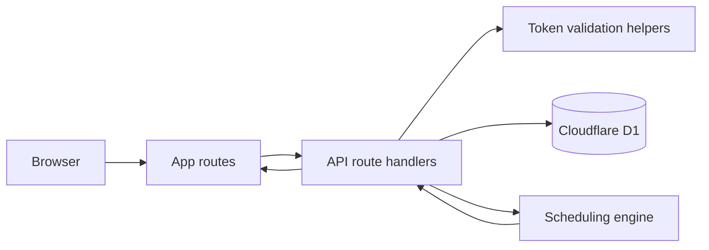
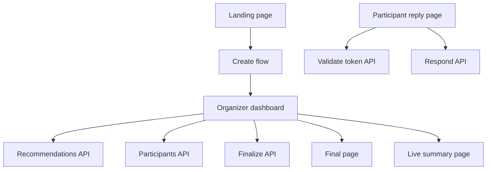
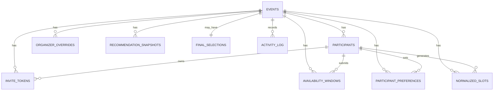
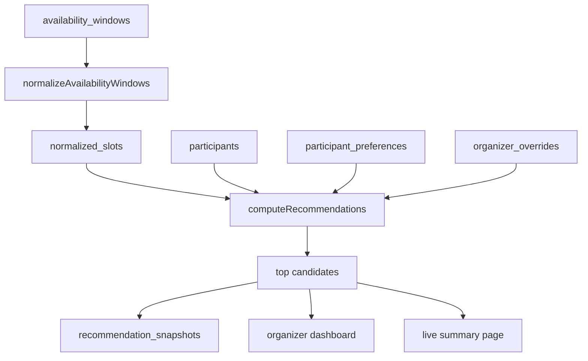

# TRD

## Document status

This TRD describes the current implementation in this repository.

It covers the app structure, runtime model, API surface, data model, and recommendation engine as they exist in the source code.

## System summary

Togoo is a token-gated scheduling app built on:

- Vinext for the app runtime
- React and App Router style pages
- Cloudflare Workers for server execution
- Cloudflare D1 as the database
- Drizzle ORM for schema and queries

The app has no account system. Access is controlled by organizer and participant invite tokens.

## Runtime architecture



## High-level component map



## Route inventory

### App routes

| Route | Purpose |
| --- | --- |
| `/` | landing page and local recent-plan shortcuts |
| `/faq` | FAQ page |
| `/events/new` | organizer create flow |
| `/r/[token]` | participant reply flow |
| `/e/[eventId]/organizer/[token]` | organizer dashboard |
| `/e/[eventId]/summary/[token]` | token-gated live summary |
| `/e/[eventId]/final` | finalized plan page |
| `/e/[eventId]/respond/[token]` | legacy redirect to `/r/[token]` |

### API routes

| Method | Route | Purpose |
| --- | --- | --- |
| `POST` | `/api/events` | create event and organizer token |
| `GET` | `/api/events/[eventId]` | organizer-only event fetch |
| `PUT` | `/api/events/[eventId]` | organizer-only event update |
| `GET` | `/api/events/[eventId]/participants` | list participants |
| `POST` | `/api/events/[eventId]/participants` | add participant |
| `PUT` | `/api/events/[eventId]/participants/[participantId]` | update participant |
| `DELETE` | `/api/events/[eventId]/participants/[participantId]` | delete participant |
| `POST` | `/api/events/[eventId]/participants/[participantId]/token` | regenerate participant token |
| `POST` | `/api/events/[eventId]/respond` | submit or update participant reply |
| `GET` | `/api/events/[eventId]/recommendations` | compute ranked meeting options |
| `POST` | `/api/events/[eventId]/finalize` | finalize selected slot |
| `POST` | `/api/events/[eventId]/reopen` | reopen finalized event |
| `GET` | `/api/events/[eventId]/overrides` | list organizer overrides |
| `POST` | `/api/events/[eventId]/overrides` | add organizer override |
| `DELETE` | `/api/events/[eventId]/overrides` | delete organizer override |
| `GET` | `/api/validate-token` | validate organizer or participant token |

## Access model

There are two token classes:

- organizer tokens
- participant tokens

Organizer-only routes require `x-organizer-token` in the request headers.

Participant reply routes use the participant token in the request body or query string.

There is no session cookie or account-based auth layer.

## Core server-side flows

### Event creation

1. Validate request with `CreateEventSchema`
2. Insert row into `events`
3. Insert organizer row into `participants`
4. Insert organizer token into `invite_tokens`
5. Insert `event_created` entry into `activity_log`
6. Return organizer dashboard URL

### Participant reply

1. Validate request with `SubmitResponseSchema`
2. Resolve participant token
3. Check event status, deadline, and editability
4. Delete old raw windows and normalized slots for that participant
5. Insert new `availability_windows`
6. Recompute and insert `normalized_slots`
7. Upsert `participant_preferences`
8. Mark participant as responded
9. Insert activity log entry

### Organizer event update

1. Validate request with `UpdateEventSchema`
2. Update `events`
3. Reload all raw windows for the event
4. Delete all `normalized_slots` for the event
5. Recompute normalized slots against the updated settings
6. If a finalized event changed schedule-affecting fields, delete final selection and set status back to `active`
7. Insert activity log entry

## Data model

Schema source:

- `lib/db/schema.ts`

### Tables

| Table | Key fields | Notes |
| --- | --- | --- |
| `events` | `title`, `timezone`, `date_range_start`, `date_range_end`, `allowed_hours_start`, `allowed_hours_end`, `meeting_duration_minutes`, `slot_granularity_minutes`, `min_attendance_threshold`, `participants_required_by_default`, `allow_participant_edit`, `show_results_to_participants`, `preferences_required`, `enabled_preferences`, `scoring_mode`, `suggested_time_start`, `suggested_time_end`, `status`, `response_deadline` | one row per plan |
| `participants` | `name`, `email`, `phone`, `role`, `is_required`, `priority_tier`, `response_status` | includes organizer row |
| `invite_tokens` | `token`, `role`, `is_active`, `expires_at` | one active organizer token, rotating participant tokens; expiry is not used in the current product flow |
| `availability_windows` | `participant_id`, `start_time`, `end_time` | raw reply windows |
| `participant_preferences` | food, budget, location, day/time, indoor/outdoor, notes | one row per event-participant pair |
| `organizer_overrides` | `override_type`, `data` | backend-only today |
| `normalized_slots` | `slot_start`, `slot_end` | slotized windows used by scoring |
| `recommendation_snapshots` | `recommendations`, `total_responded`, `computed_at` | stored on recommendation fetch |
| `final_selections` | `slot_start`, `slot_end`, `notes`, `selected_by`, `finalized_at` | one finalized selection per event |
| `activity_log` | `action`, `data`, `created_at` | audit stream |

### Entity relationship diagram



## Recommendation engine

Source:

- `lib/scheduling.ts`

### Normalization

Raw windows are converted into fixed-width slots using:

- event timezone
- date range
- allowed daily hours
- slot granularity

Only slots fully inside the event date range and allowed hours are kept.

### Candidate generation

The engine scans slot starts and intersects attendee presence across all slots required to cover the configured meeting duration.

If the full duration cannot be covered, the candidate is dropped.

### Scoring inputs

- attendance overlap
- required-attendee coverage
- priority-tier weighted attendance
- time-of-day preference fit
- weekday/weekend preference fit

### Scoring modes

| Mode | Main weighting |
| --- | --- |
| `maximize_attendance` | attendance first |
| `prioritize_required` | required attendees first |
| `vip_priority` | priority tier weighting first |
| `time_optimized` | time-of-day preference first |

### Important current limitation

Preferences that are stored but not scored today:

- food
- budget
- preferred area
- travel distance
- indoor/outdoor

## Recommendation flow diagram



## Event settings and behavior

### Organizer-configurable settings

- title
- description
- type
- timezone
- date range
- allowed hours
- duration
- slot granularity
- scoring mode
- suggested time
- response deadline
- enabled preference questions
- participant-edit setting
- participant live summary setting
- required-preference setting
- default required-attendee setting for newly added invitees

### Event status behavior

- new events start as `active`
- finalization sets event status to `finalized`
- reopen sets event status back to `active`
- editing a finalized event reopens it if schedule-affecting fields changed

## Frontend state and persistence

### Browser-local persistence

The app stores a small list of recently accessed plans in `localStorage`.

This is used by:

- `components/my-events.tsx`

It stores:

- event id
- title
- role (`organizer` or `participant`)
- token
- created timestamp

This is device-local only.

## Operational notes

### Migrations

The repo currently uses a single migration:

- `drizzle/migrations/0001_init.sql`

### Commands

```bash
npm install
npm run db:migrate:local
npm run dev
```

Remote migration:

```bash
npm run db:migrate:remote
```

### Required configuration

- `wrangler.toml` must include D1 binding `DB`
- `.env` is required for `drizzle-kit` and remote migration commands

## Current implementation gaps

- organizer overrides have backend support but no dashboard UI
- recommendation snapshots are append-only and can grow over time
- finalization supports notes in API/schema, but dashboard UI finalizes without collecting notes
- no outbound notifications
- no ICS export
- no account system or multi-organizer collaboration
- no venue or location recommendation layer

## Source files to read first

If someone needs to understand the app quickly, start here:

- `app/events/new/page.tsx`
- `app/r/[token]/page.tsx`
- `app/e/[eventId]/organizer/[token]/page.tsx`
- `app/api/events/route.ts`
- `app/api/events/[eventId]/route.ts`
- `app/api/events/[eventId]/respond/route.ts`
- `app/api/events/[eventId]/recommendations/route.ts`
- `lib/db/schema.ts`
- `lib/scheduling.ts`
- `lib/validation.ts`
